# FieldRoutes Workflow Cache Schema (Visual)

This visual describes the schema introduced by:

- `supabase/migrations/20260518191500_fr_workflow_cache.sql`
- `supabase/migrations/20260518203400_move_fr_cache_tables_to_public.sql`
- `supabase/migrations/20260518203900_grant_service_role_fr_cache.sql`
- `supabase/migrations/20260518205500_add_tracking_and_notes_fields.sql`

## ER Diagram

```mermaid
erDiagram
  fr_employees {
    bigint id PK
    bigint office_id
    text active
    text fname
    text lname
    text initials
    text employee_type
    text linked_employee_ids
    bigint access_control_profile_id
    text access_control_profile_name
    bigint primary_team
    text license_number
    text start_address
    text start_city
    text start_state
    text start_zip
    numeric start_lat
    numeric start_lng
    text display_name
    timestamptz date_updated
    timestamptz synced_at
  }

  fr_appointments {
    bigint id PK
    bigint office_id
    text status
    text status_text
    timestamptz date_added
    timestamptz date_updated
    timestamptz date_completed
    timestamptz date_cancelled
    bigint cancelled_by
    bigint employee_id
    bigint assigned_tech_id
    bigint serviced_by_id
    bigint completed_by_id
    date appointment_date
    date due_date
    text start_time_raw
    text end_time_raw
    integer duration_minutes
    text time_window
    bigint route_id
    bigint spot_id
    bigint temp_spot_id
    bigint customer_id
    bigint subscription_id
    bigint ticket_id
    bigint group_id
    text appointment_type
    timestamptz time_in
    timestamptz time_out
    timestamptz check_in
    timestamptz check_out
    numeric lat_in
    numeric lat_out
    numeric long_in
    numeric long_out
    text notes
    text office_notes
    text appointment_notes
    timestamptz synced_at
  }

  fr_sync_meta {
    bigint office_id PK
    timestamptz last_successful_sync_at
    timestamptz max_appointment_date_updated
    timestamptz max_employee_date_updated
    timestamptz updated_at
  }

  fr_employees ||--o{ fr_appointments : "employee_id"
  fr_employees ||--o{ fr_appointments : "assigned_tech_id"
  fr_employees ||--o{ fr_appointments : "serviced_by_id"
  fr_employees ||--o{ fr_appointments : "completed_by_id"
  fr_sync_meta ||--o{ fr_appointments : "office_id (logical)"
  fr_sync_meta ||--o{ fr_employees : "office_id (logical)"
```

## Model Notes

- `fr_appointments` is the workflow hub.
- Employee links are role-based and intentionally separate:
  - `employee_id`, `assigned_tech_id`, `serviced_by_id`, `completed_by_id`
- `fr_sync_meta` tracks sync watermarks per office.
- This is an operational cache model, not a full FieldRoutes mirror.

## Write Rules (at a glance)

- Upsert by PK:
  - appointments: `id = appointmentID`
  - employees: `id = employeeID`
- Skip stale updates using `date_updated`.
- Skip appointment writes when `office_id` is missing.
